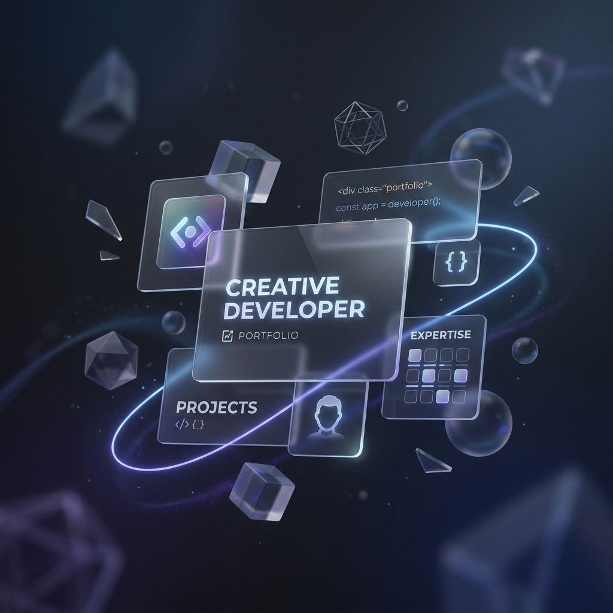

# FAH. Portfolio | Creative Developer

A high-end, editorial-grade personal portfolio built with **Next.js 14**, **Tailwind CSS**, and **Framer Motion**. Designed for maximum visual impact and smooth user experience.



## ✨ Features

- 🎬 **Cinematic Loading Screen**: Custom multi-panel intro with a progress counter.
- 🍱 **Bento Grid Skills**: Modern, interactive layout for technical stack display.
- 🖱️ **Interactive Custom Cursor**: Reactive cursor that displays context-aware text (e.g., social platform names).
- 🖼️ **Dynamic Project Gallery**: Image sliders with cinematic transitions and hover glow effects.
- 📱 **Fully Responsive**: Optimized for all devices, from mobile to ultra-wide displays.
- 🎨 **Premium Aesthetics**: Sky Blue & White theme with grid patterns, noise textures, and glassmorphism.
- 🚀 **Performant**: Built on Next.js for lightning-fast load times and SEO optimization.

## 🛠️ Tech Stack

- **Framework**: [Next.js 14 (App Router)](https://nextjs.org/)
- **Styling**: [Tailwind CSS](https://tailwindcss.com/)
- **Animations**: [Framer Motion](https://www.framer.com/motion/)
- **Icons**: [Lucide React](https://lucide.dev/) & [React Icons](https://react-icons.github.io/react-icons/)
- **Deployment**: [Vercel](https://vercel.com/)

## 🚀 Getting Started

First, install the dependencies:

```bash
npm install
```

Then, run the development server:

```bash
npm run dev
```

Open [http://localhost:3000](http://localhost:3000) with your browser to see the result.

## 📦 Project Structure

- `src/app`: Main pages and global layouts.
- `src/components`: Reusable UI components (Hero, Projects, Skills, etc.).
- `src/data`: Centralized data management for portfolio content.
- `public/images`: Asset management.

## 📄 License

This project is personal. Feel free to use it as inspiration!

---

Created with ❤️ by **Fauzan Ashril Hakiim**
